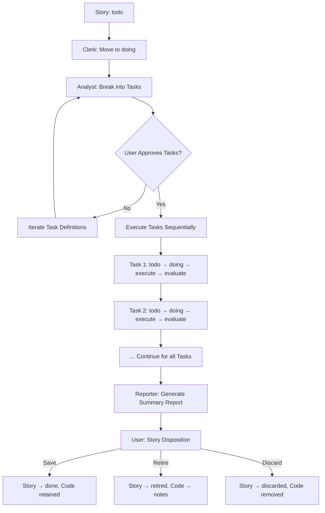

# Applying Metaphysics of Quality to Agentic Coding: The Guardrails Framework

## Chapter 4: Story and Task Lifecycle

### Introduction to the Story/Task Lifecycle

Chapter 3 established phase-specific behavioral constraints. This chapter details the **complete lifecycle** of Stories and Tasks—the fundamental work units of Guardrails. The lifecycle operationalizes the DQ/SQ rhythm through structured workflows that ensure:

1. **Rapid experimentation** (DQ) with minimal investment
2. **Explicit evaluation** and disposition decisions (SQ latching)
3. **Clean context boundaries** preventing pollution
4. **Auditability** through Git integration
5. **User sovereignty** over all architectural decisions

The lifecycle integrates the taxonomies and constraints from previous chapters into a repeatable process that scales from simple Study stories to complex feature development.

### Story Lifecycle Overview

| **State**     | **Location**                       | **Description**                                      | **Agent Role**          |
|--------------|------------------------------------|------------------------------------------------------|-------------------------|
| **Todo**     | `process_docs/stories/todo/`       | User-defined work unit with constraints              | None                    |
| **Doing**    | `process_docs/stories/doing/`      | Active execution with Tasks in progress              | All roles active        |
| **Done**     | `process_docs/stories/done/`       | Successfully completed, code retained                | Reporter (final report) |
| **Retired**  | `process_docs/stories/retired/`    | Valuable learning preserved, code archived            | Reporter (archive)      |
| **Discarded**| `process_docs/stories/discarded/`  | Unsuccessful experiment, minimal trace preserved     | Clerk (cleanup)         |

### Complete Story Workflow

The standard workflow executes the following sequence for every Story:



### Detailed Task Execution Cycle

Each Task follows this **atomic execution pattern**:

| **Step** | **Role**    | **Action**                                                                 | **Git Integration**                          | **Outcome**                    |
|---------|-------------|---------------------------------------------------------------------------|---------------------------------------------|--------------------------------|
| 1       | Clerk       | Record starting Git hash, move task to `doing/`                           | `git rev-parse HEAD` → task.start_hash      | Task file updated              |
| 2       | Coder       | Execute Task per phase constraints and directives                         | Working commits with standard message       | Code changes in working tree    |
| 3       | Clerk       | Record ending Git hash                                                   | `git rev-parse HEAD` → task.end_hash        | Task file updated              |
| 4       | Reporter    | Present results: code diff, key learnings, evaluation questions           | `git diff start_hash end_hash`              | Evaluation report              |
| 5       | User        | Decide: Save/Retire/Discard                                              | N/A                                         | Disposition decision           |
| 6       | Clerk       | Execute disposition, update task status                                   | Git operations per decision                 | Task file moved, code managed   |

### Git Workflow for Experiment Management

The Git integration provides **precise, reversible experimentation**:

| **Disposition** | **Git Commands**                                                                 | **Task Status** | **Preservation**                     | **Working Tree** |
|----------------|----------------------------------------------------------------------------------|----------------|--------------------------------------|-----------------|
| **Save**       | Keep commits as-is                                                               | `done`         | Code retained for future work         | Clean (progress)|
| **Retire**     | `git tag retired/[story-task]`<br>`git reset --hard HEAD~N`                     | `retired`      | Tagged for reference                  | Clean (reverted)|
| **Discard**    | `git reset --hard HEAD~N`                                                        | `discarded`    | No preservation (effectively forgotten)| Clean (reverted)|

**Commit Message Standard**:
```
[Story-1]: GnuCash File Selection: [Task-1.1]: Spike Code: DirectoryTree picker (Exploring)
```

**Retrospective Analysis**:
```bash
# View exactly what changed in a task
git diff task_1_1.start_hash task_1_1.end_hash

# List all retired experiments
git tag -l 'retired/*'

# Examine a specific retired experiment
git show retired/story1-task1.1
```

### Task File Structure and Metadata

**Task Definition Format**:

```markdown
# Task 1.1: DirectoryTree picker

## Metadata
| **Field**        | **Value**                          |
|------------------|------------------------------------|
| **Parent Story** | 1 - GnuCash file picker experiment |
| **Task ID**      | 1.1                                |
| **Task Name**    | try DirectoryTree picker           |
| **Task Type**    | Spike Code                         |
| **Phase**        | Exploring                          |
| **Status**       | todo                               |

## Clear Separation (MANDATORY)

**REQUEST**:
Implement file picker using DirectoryTree widget. Target example GnuCash file in `demo_work/`. Validate successful load using DataService.

**CONTEXT**:
This evaluation will inform production file picker selection.

## Universal Constraints (ALWAYS APPLY)
1. **Rule 0**: Complete, then stop - deliver REQUEST only
2. **Context ≠ Requirements**: Ignore future production concerns
3. **Phase Constraints**: [Exploring phase rules]

## Focus
[1-2 sentence implementation guidance]


**File Organization**:
```
process_docs/
├── stories/
│   ├── todo/
│   ├── doing/
│   ├── done/
│   ├── retired/
│   └── discarded/
├── tasks/
│   ├── todo/
│   │   ├── task_1_1.md
│   │   ├── task_1_2.md
│   │   └── task_1_3.md
│   ├── doing/
│   ├── done/
│   ├── retired/
│   └── discarded/
└── reports/
    ├── task_reports/
    └── story_summaries/
```

### User Evaluation Protocols

#### Study Story Evaluation (Subjective)

**Reporter's Role**: Facilitate, don't evaluate

| **Provide**                          | **Avoid**                              |
|--------------------------------------|----------------------------------------|
| ✓ Code diff highlighting changes     | ✗ Scoring against criteria             |
| ✓ Key differences between approaches | ✗ Recommending "best" option           |
| ✓ What was learned/discovered        | ✗ Objective evaluation                 |
| ✓ Open questions: "What do you see?" | ✗ Leading questions                    |

**User's Evaluation Process**:
1. **Examine** the resulting code
2. **Imagine** where it might lead architecturally
3. **Apply** design intuition and experience
4. **Decide**: Shape toward preferred direction or cut off

#### Technical Story Evaluation (Objective)

For later phases (Settling+), evaluation includes:

| **Criteria**              | **Early Phases** | **Later Phases** |
|---------------------------|-----------------|-----------------|
| Meets functional requirements | ✓              | ✓               |
| Follows phase constraints     | ✓              | ✓               |
| API stability                |                | ✓               |
| Test coverage                |                | ✓               |
| Performance                  |                | ✓               |

### Story Summary Report Template

**Generated by Reporter after all Tasks complete**:

```markdown
# Story 1 Summary: GnuCash File Selection Experiment

## Overview
| **Phase**    | **Story Type** | **Status** | **Duration** |
|-------------|---------------|------------|--------------|
| Exploring   | Study         | Done       | 2.5 hours    |

## Task Results
| **Task ID** | **Type**     | **Disposition** | **Key Learnings**                  |
|------------|--------------|----------------|------------------------------------|
| 1.1        | Spike Code   | Retired        | DirectoryTree too complex for files |
| 1.2        | Spike Code   | Saved          | textual-fspicker: good UX, easy     |
| 1.3        | Spike Code   | Discarded      | textual-filedrop: drag-drop limited |

## Architectural Decision
**Selected**: textual-fspicker for production implementation
**Rationale**: Best balance of usability, integration complexity, and feature completeness

## Next Steps
- Story 2: Implement production file picker (Pioneering phase)
- Story 3: User interaction flow integration (Settling phase)
```

### Context Management Patterns

#### Fresh Start Protocol

1. **Task Independence**: Each Task starts with clean context
2. **Explicit Phase Declaration**: Every prompt includes phase constraints
3. **Minimal Carryover**: Only Story metadata + current Task details
4. **Git Reset Discipline**: Previous experiments don't pollute working tree

#### Session Reset Strategy

| **Trigger**                  | **Action**                                      | **Preservation**                  |
|------------------------------|-------------------------------------------------|-----------------------------------|
| Context degradation          | Start new session with Story + current Task     | Git hashes maintain continuity    |
| Unwanted scope creep         | Reset + reinforce phase constraints             | Task report documents the issue    |
| User architectural pivot     | New Story with updated constraints              | Retire previous work              |

#### Context Supply Template

```
CONTEXT FOR TASK [ID]:
1. PHASE: [Phase Name] - [Autonomy Level]
2. STORY: [Story Name] - [Goal]
3. TASK: [Task Name] - [Focus]
4. CONSTRAINTS: [3-5 key rules for this phase]
5. RESOURCES: [Codebase access, CLAUDE.md]
6. GIT: Current hash [hash]
EXECUTE PER PHASE RULES
```

### Advanced Lifecycle Patterns

#### Concurrent Story Execution

Different project areas progress independently:

| **Component**      | **Story**                | **Phase**    | **Status** |
|-------------------|--------------------------|-------------|------------|
| File Selection    | GnuCash picker           | Settling    | Doing      |
| Transaction Parse | CSV import               | Exploring   | Todo       |
| UI Framework      | Textual integration      | Fortifying  | Done       |

#### Task Dependencies

**Intra-Story Dependencies**:
```
Task 1.1 → Task 1.2 → Task 1.3
(Sequential execution)
```

**Inter-Story Dependencies**:
```
Story 1 (Exploring) → Story 2 (Pioneering)
(Architectural decisions inform subsequent stories)
```

#### Bulk Task Approval

For trusted patterns, users can approve multiple Tasks at once:

```markdown
## Bulk Approval Decision
APPROVED: Tasks 2.1, 2.2, 2.3
RATIONALE: Standard integration pattern, Analyst breakdown follows phase guidelines
```

### Metrics and Process Health Indicators

| **Metric**                     | **Target**         | **Purpose**                              |
|--------------------------------|-------------------|-----------------------------------------|
| Tasks per Story                | 3-7                | Maintain small, manageable units        |
| Task approval rate (1st pass)   | >85%               | Indicates clear specifications          |
| Average review time per Task    | <5 minutes         | Prevents user fatigue                   |
| Discard rate                   | 20-40% (Exploring) | Healthy experimentation                |
| Context reset frequency         | <1 per Story       | Effective constraint enforcement        |
| Story completion rate           | >95%               | Process reliability                    |

### Integration with Version Control

**Branching Strategy** (optional for complex projects):
```
main
├── story-1-exploring-file-picker
├── story-2-pioneering-ui-flow
└── story-3-settling-integration
```

**Tag Conventions**:
```
retired/story-1-task-1.1-2025-11-12
done/story-2-2025-11-15
milestone/v0.1-fortified-core-2025-11-20
```

### Error Recovery and Process Resilience

| **Failure Mode**               | **Recovery Action**                              | **Prevention**                           |
|--------------------------------|-------------------------------------------------|-----------------------------------------|
| Task exceeds phase constraints  | Discard + refined Task definition                | Clearer phase rules in Story            |
| Analyst proposes wrong Tasks    | Iterative refinement until user approval         | Analyst training on taxonomies          |
| Coder violates constraints      | Discard + phase reminder in next Task            | Context template enforcement            |
| User evaluation overload        | Smaller Tasks, better Reporter summaries         | Task size limits                        |
| Git workflow confusion          | Automated Clerk scripts                          | Standardized commit messages            |

### Future Tooling Evolution

**Current**: File-based (`.md` files in `process_docs/`)
**Planned**: Database + CLI tools

| **Current**                  | **Future**                        | **Benefit**                          |
|------------------------------|-----------------------------------|--------------------------------------|
| Manual file movement         | `gr clerk move-task 1.1 doing`     | Automation                           |
| Manual Git hash recording    | Auto-capture via Clerk            | Reliability                          |
| Manual reports               | `gr reporter generate 1.1`         | Consistency                          |
| File system navigation       | `gr stories list --phase exploring`| Discoverability                      |

This chapter provides the complete operational blueprint for executing Guardrails. Chapter 5 will examine advanced context management techniques and process measurement, building on these lifecycle patterns to achieve the constraint effectiveness and context purity goals established in Chapter 1.

---

