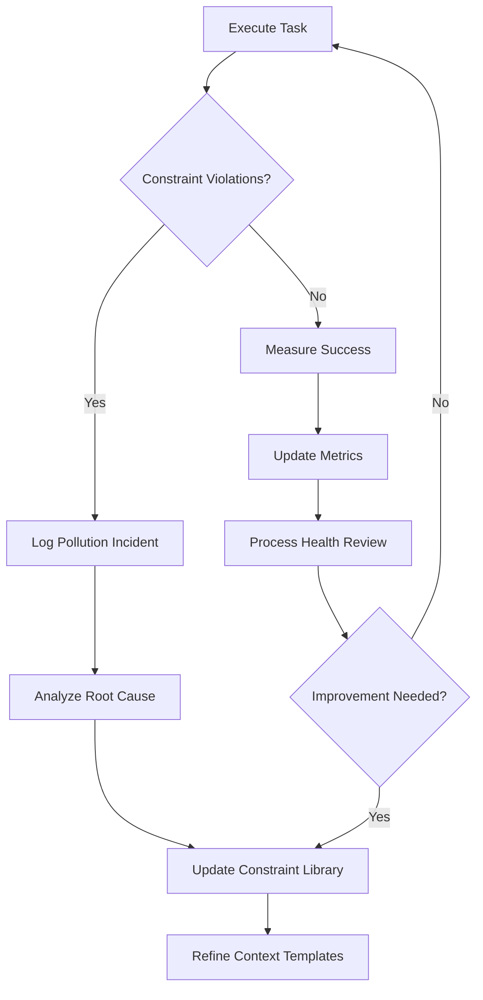

# Applying Metaphysics of Quality to Agentic Coding: The Guardrails Framework

## Chapter 5: Context Management in Practice

### Introduction to Context Management

Chapters 3 and 4 established the constraint system and workflow mechanics. Chapter 5 addresses the **second pillar** of the Guardrails approach: **Context Management**. This chapter provides advanced techniques for maintaining **pure, focused context** throughout the development process, directly solving the "context pollution" problem identified in Chapter 1.

Context management ensures:
1. **Fresh starts** for every Task execution
2. **Precise information supply** tailored to phase and role
3. **Pollution prevention** through structural isolation
4. **Degradation resistance** across long sessions
5. **Recovery protocols** for inevitable context drift

Effective context management transforms agentic coding from frustrating, session-bound interactions into a **scalable, repeatable process**.

### Context Pollution Patterns and Their Impact

| **Pollution Type**          | **Symptoms**                                      | **Consequences**                              | **Guardrails Prevention**                  |
|----------------------------|---------------------------------------------------|----------------------------------------------|-------------------------------------------|
| **Scope Creep Carryover**   | Agent reintroduces discarded features             | Premature production-quality code            | Task independence, phase declarations      |
| **Session Degradation**     | Response quality declines over time               | Inconsistent constraint adherence            | Fresh start protocol                      |
| **Unwanted Mental Models**  | Agent assumes architectural decisions             | Misaligned solution approaches               | Explicit constraint reinforcement          |
| **Accumulated Artifacts**   | Irrelevant code/docs in context window            | Slower responses, higher token costs         | Git-based experiment isolation            |
| **Lost Intent**             | Original learning goals forgotten                 | Work diverges from Story objectives          | Context supply templates                  |

### Fresh Start Protocol

**Core Principle**: Every Task execution begins with **clean context** containing **only** the information required for success.

#### Context Supply Template

```
CONTEXT FOR TASK EXECUTION:

🔍 UNIVERSAL CONSTRAINTS (MANDATORY - ALL PHASES):
0. **Complete, Then Stop**: Deliver REQUEST only
1. **Context ≠ Requirements**: Background for understanding ONLY

📋 STORY: [Story ID] - [Name]
   REQUEST: [Exact story goal]
   CONTEXT: [Background information]

🎯 TASK: [Task ID] - [Name] ([Task Type])
   REQUEST: [Exact task deliverable]
   CONTEXT: [Task-specific background]

⚡ PHASE CONSTRAINTS:
[3-5 phase-specific rules]

🚫 PROHIBITED (Universal + Phase):
- Future architecture from CONTEXT
- Production features not in REQUEST
- [Phase-specific prohibitions]

🛠️ EXECUTION DIRECTIVE:
Execute exactly the REQUEST above. Ignore all CONTEXT mentions of future work.
```

#### Example Context Supply

```
CONTEXT FOR TASK EXECUTION:

🔍 PHASE: Exploring - HIGH Autonomy
📋 STORY: 1 - GnuCash File Selection Experiment
   Goal: Evaluate file picker widget options
   
🎯 TASK: 1.1 - try DirectoryTree picker (Spike Code)
   Focus: Implement file picker using DirectoryTree widget targeting demo_work/gnucash_file.gnucash

⚡ PHASE CONSTRAINTS (MANDATORY):
1. Write minimum code necessary to answer the question
2. Ignore error handling, UI polish, edge cases
3. Use hard-coded values, print statements
4. Unblock yourself pragmatically (delete DB if needed)

🛠️ RESOURCES:
- Full ctrack codebase
- CLAUDE.md for project structure
- Current Git state: a1b2c3d

📝 EXECUTION DIRECTIVE:
Build minimal spike to test DirectoryTree for file picking.
Validate by loading file with DataService.
Commit: "[1]: GnuCash File Selection: [1.1]: Spike Code: DirectoryTree picker"

🚫 PROHIBITED (Exploring phase):
- try/except blocks
- Comprehensive documentation
- Test suites
- Configuration files
- Classes/abstractions
```

### Session Reset Strategies

| **Reset Trigger**            | **Immediate Action**                          | **Preservation Mechanism**              | **Recovery Time** |
|------------------------------|----------------------------------------------|-----------------------------------------|-------------------|
| **Constraint Violation**      | Fresh start + reinforced phase rules          | Git hashes document the violation       | 2-3 minutes       |
| **Performance Degradation**   | New session with Context Supply Template      | Task reports maintain continuity        | 1-2 minutes       |
| **Architectural Pivot**       | New Story with updated constraints            | Retire previous Story                   | 5-10 minutes      |
| **Context Window Exhaustion** | Task-level isolation (one Task per session)   | File-based task definitions             | 1 minute          |
| **User Fatigue**              | Pause + Reporter summary review               | Summary reports + metrics               | Variable          |

#### Automated Reset Checklist

```markdown
## Session Reset Protocol

**WHEN**: Any of these conditions occur:
- [ ] Agent introduces prohibited phase features
- [ ] Response quality noticeably declines
- [ ] Context window >80% capacity
- [ ] >3 constraint violations in session
- [ ] User review time >10 minutes per Task

**DO**:
1. [ ] Save current Git hashes
2. [ ] Generate Task report
3. [ ] Start NEW session
4. [ ] Use Context Supply Template
5. [ ] Reinforce phase constraints x2
6. [ ] Execute disposition (Save/Retire/Discard)
```

### Structural Isolation Techniques

#### File-Based Context Boundaries

```
process_docs/
├── stories/                 # Immutable once created
│   └── doing/
│       └── story_1.md      # Complete context for ALL tasks
├── tasks/                  # Atomic, independent units
│   ├── todo/              # Proposed work
│   │   ├── task_1_1.md    # ONLY this task's context
│   │   └── task_1_2.md
│   └── doing/
│       └── task_1_1.md    # Current execution context
└── reports/               # Immutable records
    ├── task_1_1.md        # What happened
    └── story_1_summary.md # Big picture
```

#### Task Independence Guarantees

| **Property**                | **Guarantee**                                      | **Mechanism**                          |
|-----------------------------|----------------------------------------------------|----------------------------------------|
| **Zero Knowledge Dependency**| Task doesn't know about sibling tasks              | File isolation                         |
| **Clean Working Tree**       | Previous experiments don't affect current task     | Git reset discipline                   |
| **Phase Consistency**        | All tasks inherit same phase constraints           | Story-level phase declaration          |
| **Independent Evaluation**   | Each task evaluated on own merits                  | Individual disposition decisions       |

### Context Supply Optimization Patterns

#### Progressive Disclosure

| **Information Type** | **Early Phases** | **Later Phases** | **Rationale** |
|---------------------|-----------------|-----------------|---------------|
| Architecture docs   | Minimal         | Comprehensive   | Avoid premature optimization |
| Test requirements   | None            | Detailed        | Focus on learning first |
| Error handling specs| None            | Complete        | Production concerns later |
| Integration details | Basic           | Full            | Validate approach first |
| Performance targets | None            | Specific        | Optimize proven solutions |

#### Role-Specific Context Tailoring

| **Role**     | **Context Elements**                          | **Excluded Elements**                  |
|-------------|----------------------------------------------|---------------------------------------|
| **Analyst** | Story goal, phase rules, codebase survey      | Implementation details, test specs     |
| **Coder**   | Task focus, phase constraints, current Git    | Other tasks, architectural decisions   |
| **Reporter**| Task hashes, phase success criteria, results  | Implementation decisions               |
| **Clerk**   | Workflow state, file locations, Git commands  | Technical content                      |

### Context Degradation Metrics

| **Metric**                    | **Healthy Range** | **Warning**     | **Critical**    | **Action**                  |
|-------------------------------|------------------|----------------|----------------|-----------------------------|
| Response coherence (0-100)     | >90             | 70-89          | <70            | Fresh start                 |
| Constraint adherence (%)       | >95             | 85-94          | <85            | Reset + reinforcement       |
| Review time per Task (minutes) | 1-5             | 6-10           | >10            | Task decomposition          |
| Token efficiency (tokens/LOC)  | <500            | 500-1000       | >1000          | Context pruning             |
| First-pass approval rate (%)   | >85             | 70-84          | <70            | Specification refinement    |

### Advanced Context Management Techniques

#### Context Pruning Strategies

| **Technique**              | **When to Use**                          | **Implementation**                           | **Benefit**                          |
|----------------------------|-----------------------------------------|---------------------------------------------|--------------------------------------|
| **Phase Declaration First** | Every session start                      | "You are in Exploring phase: HIGH autonomy"  | Sets behavioral expectations         |
| **Constraint Triad**        | After phase declaration                  | "Rule 1, Rule 2, Rule 3 - MANDATORY"         | Reinforcement without repetition     |
| **Negative Space**          | When violations common                   | "🚫 PROHIBITED: error handling, tests..."    | Clear boundaries                    |
| **Git Context Anchor**      | Before execution                         | "Current Git state: [hash]"                  | Working tree clarity                |
| **Success Visualization**   | In evaluation phase                      | "Success = [3 criteria], NOT [3 things]"     | Aligns mental model                 |

#### Context Supply Evolution by Phase

| **Phase**      | **Context Density** | **Constraint Count** | **Autonomy Language** | **Example Directive** |
|---------------|--------------------|---------------------|----------------------|---------------------|
| **Exploring** | Low                | 3-5                 | "Figure it out"      | "Build minimal spike" |
| **Pioneering**| Medium             | 5-7                 | "Make reasonable choices" | "Validate approach" |
| **Settling**  | Medium-High        | 7-9                 | "Follow patterns"    | "Solidify APIs"     |
| **Fortifying**| High               | 9-12                | "Follow specs"       | "Add comprehensive tests" |
| **Re-Founding**| Very High         | 12+                 | "Exact implementation" | "Preserve existing functionality" |

### Recovery and Remediation Protocols

#### Constraint Violation Recovery

```markdown
## Constraint Violation Report

**Task**: 1.2 - textual-fspicker
**Violation**: Added comprehensive error handling (Exploring phase)
**Impact**: 150 LOC review burden, context pollution

**Immediate Actions**:
1. Discard this Task
2. Fresh start with reinforced Exploring constraints
3. Add to directive library: "NO error handling in Exploring"

**Updated Context Template**:
🚫 PROHIBITED: error handling, logging, tests, documentation
```

#### Session Recovery Template

```
SESSION RECOVERY PROTOCOL:

**Issue**: [Describe degradation/pollution]
**Preserved State**: 
- Git start_hash: [hash]
- Git end_hash: [hash]
- Task file: [path]

**Clean Restart**:
1. Review `git diff start_hash end_hash`
2. Execute disposition: [Save/Retire/Discard]
3. Start NEW session with this template
4. Double reinforcement of phase constraints

**Learnings for Process**:
- [What caused the pollution]
- [Updated constraint needed]
```

### Integration with Existing Tools

#### GitHub Codespaces / VS Code Integration

**`.vscode/settings.json`**:
```json
{
  "guardrails.contextTemplate": true,
  "guardrails.phaseReminder": true,
  "guardrails.freshStart": "always"
}
```

#### IDE Extensions (Future)

| **Feature**                | **Purpose**                              | **Implementation**                    |
|----------------------------|-----------------------------------------|--------------------------------------|
| Context Template Generator | Auto-generate clean context              | Story/Task metadata → template       |
| Phase Constraint Linter    | Validate responses against phase rules   | Real-time constraint checking        |
| Git Hash Integration       | Auto-capture start/end hashes            | Pre-commit hooks                     |
| Task File Navigation       | Quick-jump between related files         | Tree view integration                |

### Measurement and Continuous Improvement

#### Context Health Dashboard

| **Metric**                  | **Formula**                              | **Target** | **Action Threshold** |
|-----------------------------|-----------------------------------------|------------|---------------------|
| **Context Purity Score**     | (Clean sessions / Total sessions) × 100  | >95%       | <90% → Process audit |
| **Pollution Incidents**      | Violations per Story                     | <1         | >2 → Constraint review |
| **Reset Efficiency**         | Avg recovery time (minutes)              | <3         | >5 → Template refinement |
| **Constraint Effectiveness** | First-pass approvals / Total Tasks       | >85%       | <75% → Rule clarification |

#### Process Improvement Loop



### Practical Implementation Checklist

| **Practice**                        | **Frequency** | **Responsibility** | **Verification**                     |
|-------------------------------------|--------------|-------------------|--------------------------------------|
| Use Context Supply Template          | Every Task   | Clerk             | Template validation                  |
| Phase declaration in first sentence  | Every session| All roles         | Response acknowledgment              |
| Constraint triad reinforcement       | Every prompt | All roles         | Explicit confirmation in response    |
| Git hash recording                  | Every Task   | Clerk             | Hash validation                      |
| Pollution incident logging           | As needed    | Reporter          | Incident review in Story summary     |
| Session reset when metrics degrade   | As needed    | User/Clerk        | Post-reset quality improvement       |

### Case Study: Context Management Success

**Before Guardrails**:
- Session lasted 2 hours
- 5 constraint violations
- 400 LOC to review
- 3 full context resets
- Frustration level: High

**After Context Management**:
- 15-minute sessions per Task
- 0 constraint violations
- 60 LOC average per Task
- 0 full resets
- Review time: 3 minutes per Task
- Frustration level: Low

**Key Changes**:
1. Context Supply Template adoption
2. Task independence enforcement
3. Phase constraint reinforcement
4. Git workflow discipline

This chapter provides the complete toolkit for **context purity** in agentic coding. Chapter 6 will examine process measurement, continuous improvement, and scaling Guardrails across projects and teams.

---

